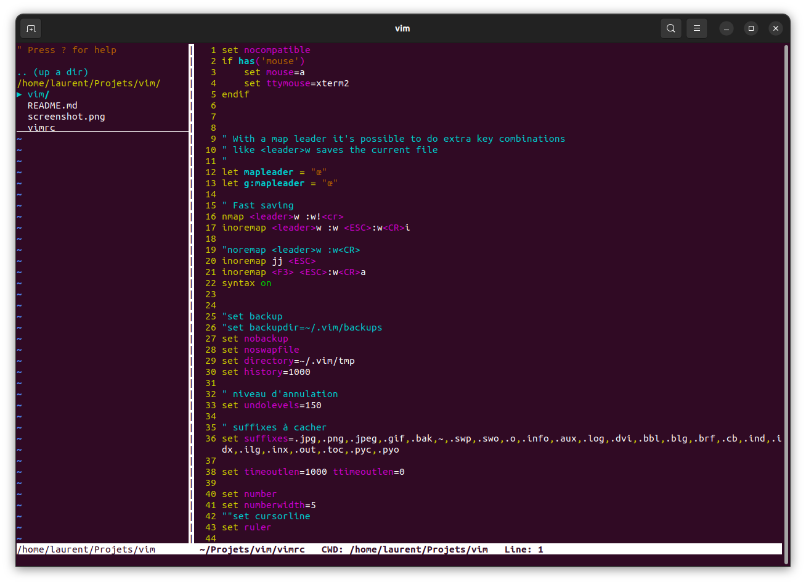

# vim
vim configuration

---

# Vim plug NerdTree

## Introduction

The NERDTree is a file system explorer for the Vim editor. Using this plugin, users can visually browse complex directory hierarchies, quickly open files for reading or editing, and perform basic file system operations.

